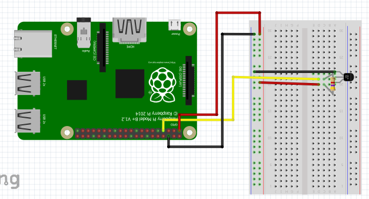

Sensors
=======

This section is to be completed by the students of the class.

Task is to develop an object oriented class for one of the sensors. An
example for such a class can be found at:

-   <https://github.com/cloudmesh/cloudmesh.pi/blob/master/cloudmesh/pi/led.py>


DS18B20 Temperature Sensor
--------------------------

The DS18B20 is a thermoresistive temperature sensor and can be found in many of the sensor kits available for purchase.  To set up the DS18B20 connect the jumper wires as shown in +@fig:ds18b20_setup.  

{#fig:ds18b20_setup}

The code needed to read the temperature from the DS18B20 can be found [here.](https://github.com/cloudmesh-community/fa18-523-84/tree/master/paper/code)

Temperature and Humidity Sensor Module
--------------------------------------

The temperature and humidity sensor used in this example is the DHT11 sensor which can be purchased as a part of the [Kookye Smart Home Sensor kit](https://www.amazon.com/gp/product/B01J9GD3DG/ref=oh_aui_detailpage_o03_s01?ie=UTF8&psc=1) or the [Elegoo Uno Kit.](https://www.amazon.com/ELEGOO-Project-Starter-Tutorial-Arduino/dp/B01D8KOZF4/ref=sr_1_6?s=electronics&ie=UTF8&qid=1542065611&sr=1-6&keywords=dht11+temperature+and+humidity+module)

To set up the DHT11 sensor connect jumper wires to the Raspberry Pi as shown in +@fig:dht11_setup.  Ensure that the ground wire of the DHT11 is connected to the ground rail of the breadboard or a ground pin on the Raspberry Pi.  The VCC wire of the DHT11 should be connected to 3.3v from the Raspberry Pi.  To recieve data the middle pin should be connected to one of the GPIO pins on the Raspberry Pi.  In this example and associated code we connect the data wire to GPIO 4 on the Raspberry Pi as shown in +@fig:dht11_setup.

{#fig:dht11_setup}

The code needed to read the temperature, humidity or print both can be found [here.](https://github.com/cloudmesh-community/fa18-523-84/tree/master/paper/code)  The sample code provides a class that utilizes the Adafruit_DHT module which can be set up by executing the following code in a terminal on your Raspberry Pi.

```
# code for humidity sensor on git hub
# Source: https://stackoverflow.com/questions/28913592/python-gpio-code-for-dht-11-temperature-sensor-fails-in-pi-2
git clone https://github.com/adafruit/Adafruit_Python_DHT.git
cd Adafruit_Python_DHT
sudo apt-get update
sudo apt-get install build-essential python-dev
sudo python setup.py install
```


Compass
-------

TODO: which compass sensor

The default pins are defined in variants/nodemcu/pins_arduino.h as GPIO

    SDA=4 
    SCL=5
    D1=5 
    D2=4.

You can also choose the pins yourself using the I2C constructor
Wire.begin(int sda, int scl);
