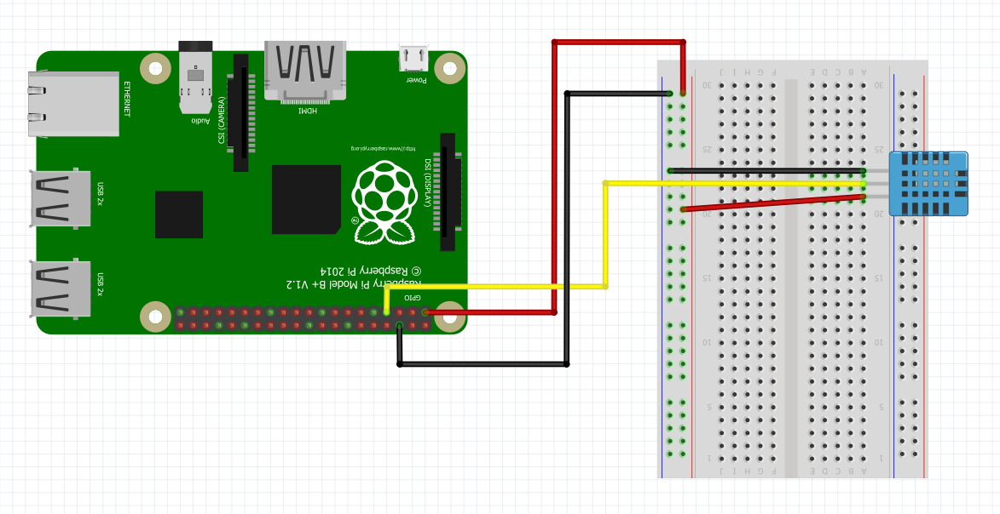

Sensors
=======

This section is to be completed by the students of the class.

Task is to develop an object oriented class for one of the sensors. An
example for such a class can be found at:

-   <https://github.com/cloudmesh/cloudmesh.pi/blob/master/cloudmesh/pi/led.py>


Temperature and Humidity Sensor Module
--------------------------------------


{#fig:dht11_setup}

```
# example of a class used for DHT11 temp and humididy sensor.
# Sources: 
#	http://www.circuitbasics.com/how-to-set-up-the-dht11-humidity-sensor-on-the-raspberry-pi/
#	https://github.com/adafruit/Adafruit_Python_DHT
# Adafruit_DHT is a dependency of this class


class READ_DHT11(object):

	def __init__(self, pin=4):
		try:
			import sys
			import Adafruit_DHT
		except:
			print('Dependency error: Ensure Adafruit_DHT is installed. https://github.com/cloudmesh-community/fa18-523-84/blob/master/project-code/thermostat_setup.sh') 
		self.pin = pin
		self.sensor = Adafruit_DHT.DHT11

	def return_temp(self, measure='celcius'):
		humid, temp = Adafruit_DHT.read_retry(sensor, pin)
		if temp is not None and measure == 'celcius':
			return temp
		elif temp is not None and measure == 'farenhiet':
			return temp * 9.0 / 5.0 + 32.0
		else:
			print('Error: no reading detected')
			return

	def return_humid(self):
		humid, temp = Adafruit_DHT.read_retry(sensor, pin)
		if humid is not None:
			return humid
		else:
			print('Error: no reading detected')
			return

	def print_reading(self, measure='celcius'):
		if measure == 'celcius':
			return 'Temp: '+str(return_temp(measure=measure))+'C  Humidity:'+str(return_humid())+'%'
		elif measure == 'farenhiet':
			return 'Temp: '+str(return_temp(measure=measure))+'F  Humidity:'+str(return_humid())+'%'
		else:
			print('Error: no reading detected')
			return


# loop to read temp and humidity

import time

while True:
	print(READ_DHT11(pin=4).print_reading(measure='farenhiet'))
	time.sleep(1)
        
```


Compass
-------

TODO: which compass sensor

The default pins are defined in variants/nodemcu/pins_arduino.h as GPIO

    SDA=4 
    SCL=5
    D1=5 
    D2=4.

You can also choose the pins yourself using the I2C constructor
Wire.begin(int sda, int scl);
