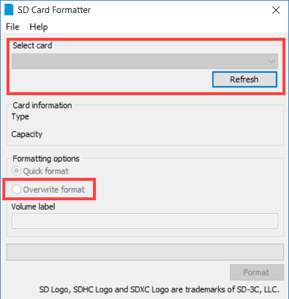
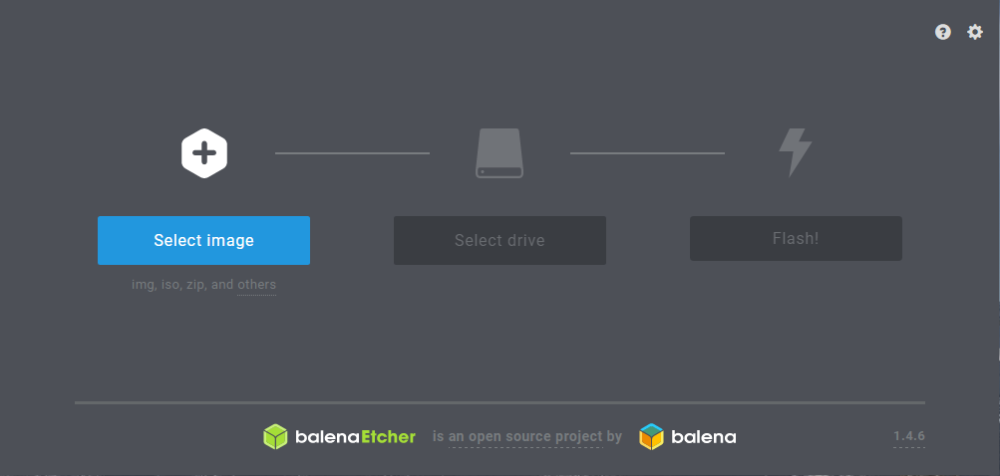

# Cassandra on a Raspberry Pi Cluster :hand: fa18-523-84

TODO: See where this fits into the Pi book...

## Prerequsites:

  * [Assembling the Pi Cluster](https://github.com/cloudmesh-community/book/blob/master/chapters/pi/case.md#build-your-own-5-node-pi-cluster)
  * [Set up small cluster by hand](https://github.com/cloudmesh-community/book/blob/master/chapters/pi/setup-ultimate.md)
  
## Setting up a Small Pi Cluster by Hand 

:warning: (Should probably be moved to book/chapters/pi/setup-ultimate.md)

### Step 1: Burning OS image to SD cards

The first step in setting up the raspberry pi cluster is to burn the OS image to the SD cards.  In this example we are using [SanDisk 32GB microSD cards.](https://www.amazon.com/Sandisk-Ultra-Micro-UHS-I-Adapter/dp/B073JWXGNT/ref=sr_1_5?s=pc&ie=UTF8&qid=1542828848&sr=1-5&keywords=32+gb+micro+sd+card)  If your computer does not have an SD card reader you may need to [purchase one](https://www.amazon.com/Anker-Portable-Reader-RS-MMC-Micro/dp/B006T9B6R2/ref=sr_1_3?s=electronics&ie=UTF8&qid=1542828941&sr=1-3&keywords=sd+card+reader) for this step.  The first part of this step is to download the required software / files.

  * [Raspbian Stretch Lite](https://www.raspberrypi.org/downloads/raspbian/) - The OS we will be using for the nodes in our pi cluster.
  * [SD Formatter](https://www.sdcard.org/downloads/formatter_4/) - This will be used to ensure the SD card is formatted correctly.
  * [Etcher](https://www.balena.io/etcher/) - Software used to burn the OS image to the SD card.

Once you have the required software and OS image file we can set up each SD card.  In order to ensure the SD card is formatted correctly we will want to run the SD Card Formatter tool.  Ensure that you don't have any other drives connected to you computer and carefully select the drive that corresponds to your SD card.  Then select overwrite format and click format.  This step can take a few minutes but it is good practice to ensure the correct formatting.



While the SD card is formatting you will want to extract the Raspbian Lite image from the zipfle it was downloaded in.  Extract this to your desktop so that it can be used in the next step.  Once the SD card is formatted you can open Etcher.  Select the Raspbian Lite image we saved to the desktop and then check to make sure the correct SD drive is selected by Etcher.  Then click "Flash!".  Once this is done you should have the Raspbian Lite image burned to the SD card.



Before pluging the SD card into the Raspberry Pi we will want to add a file to the boot partition.  Open notepad or another editor and save a blank file as "ssh" with no file extension.  When the raspberry pi boots up it will see this file and enable SSH connections.  At this point we will also edit the **config.txt** file.  In the file we need to uncomment this line: ```hdmi_force_hotplug=1```.  This will ensure that your monitor will work correctly should you need to plug it in to trouble shoot during the next step.

**Optional:** For this example we will be connnecting the parent node of our cluster to a WiFi network.  This can be done automatically by adding a file to the boot partition of the SD card (same location as the ssh file).  To do this open up a text editor and add the following code to the file [@Headless setup].

```
country=US
ctrl_interface=DIR=/var/run/wpa_supplicant GROUP=netdev
update_config=1

network={
    ssid="your_real_wifi_ssid"
    scan_ssid=1
    psk="your_real_password"
    key_mgmt=WPA-PSK
}
```

Once the code has been added save the file as **wpa_supplicant.conf** in the boot partition.

Another great resource for the initial set is a [youtube video](https://www.youtube.com/watch?v=H2rTecSO0gk) put together by Davy Wybiral [@Youtube Cluster Setup].

### Step 2: Setting up the parent node

To get started we need to set up the parent node.  This node can be connected to WiFi or Ethernet but in this example we will be setting up the parent node to connect to WiFi and then to interact with the other nodes using a network switch.

**Connect to WiFi:**

First we need to connect the parent node to WiFi (you may need to connect a monitor and keyboard for this step).  You may have been able to do a headless setup of the WiFi in step 1, but if not you can set up WiFi by using the ```sudo raspi-config``` command.  Before connecting we will want to ensure that the password is changed.  This can be done by selecting the change password option.  Once the password is updated navigate to "Network Options" and then select "Wi-fi" and enter the ssid and password of the WiFi network you want to connect to.  It is also a good idea to change the hostname so that it is easy to determine which node we are connected to.  You can also do this in the "Network Options" section by selecting "Hostname".  In this example we rename our parent node to **PiCluster001**.

Once you are connected to WiFi ensure you are able to SSH to the parent node.  Use ```ifconfig``` in the terminal to get the IP address for the parent node and you can use a tool such as [PuTTY](https://www.chiark.greenend.org.uk/~sgtatham/putty/latest.html) to connect.

**Install git:**

 1. To install git run the following command: ```sudo apt-get update and sudo apt-get install git```
 2. Once git is finished installing you will need to configure the tool:
  * Run ```git config --global user.email "you@example.com"``` to add your user email.
  * Run ```git config --global user.name "Your Name"``` to add your username.
 3. Once you have configured git you will need to clone the following repository in order to use the setup scripts and application code.
  * First create a directory to store git repositories: ```mkdir git-repos```
  * ```git clone https://github.com/cloudmesh-community/fa18-523-84.git```
 
**Final Setup Steps:**
 * run shell script to load python packages needed.
 
 * Plug monitor and keyboard into first node.  We will set up wifi which will allow us to SSH to the parent node.  Also configure other settings and change hostname and password.  Lastly we will need to download the needed software for the node.
 * 
 
 Find the IP addresses for each of the worker nodes.  ```arp -a```  if that command does not work we will need to plug the monitor in to view the IP address.
 * Once we have the IP addresses we can finish setting up the nodes using the fabric code.  (need to finish writing the script for this.)

## Sources (will be integrated in jabref)

* OS Install guide: https://www.raspberrypi.org/documentation/installation/installing-images/README.md
* Youtube Cluster Setup: https://www.youtube.com/watch?v=H2rTecSO0gk
* Headless setup: https://www.raspberrypi.org/forums/viewtopic.php?t=191252
* HDMI Monitor Signal issue: https://www.raspberrypi.org/forums/viewtopic.php?t=34061
* Fabric documentation: http://docs.fabfile.org/en/latest/getting-started.html
* Git Setup: https://www.atlassian.com/git/tutorials/install-git
